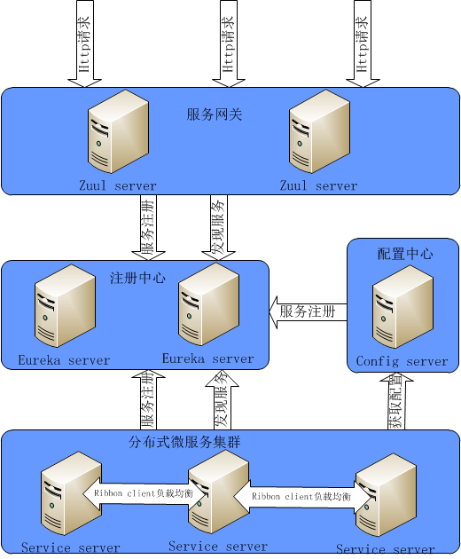
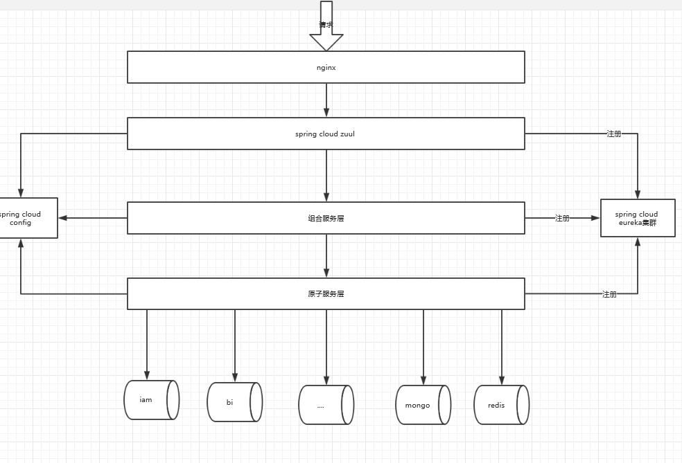

# 重构示例
    暂无
## 项目介绍
    暂无
### 组织结构

``` lua

rebuild_hyjf
├── hyjf_framework -- 父工程，管理jar版本
├── hyjf-common -- 公共模块
├── hyjf-mybatis-generator -- mybatis自动生成工具
├── hyjf_eureka -- 注册中心[端口:1111]
├── hyjf_config_server -- 配置中心[端口:2222]
├── hyjf_zuul -- 网关[端口:18080]

├── hyjf_bs -- 基础配置微服务
|    ├── hyjf_bs_common -- vo request response 
|    ├── hyjf_bs_dao -- 代码生成模块 + 自定义
|    └── hyjf_bs_server -- 基础配置服务端[端口:8087]
├── hyjf_iam -- 注册微服务
|    ├── hyjf_iam_common -- vo request response 
|    ├── hyjf_iam_dao -- 代码生成模块 + 自定义
|    └── hyjf_iam_server -- 服务端[端口:8083]
├── hyjf_cs_iam -- 注册组合微服务 [端口:8085] 
├── hyjf_mc -- 消息中心微服务
|    ├── hyjf_mc_common -- vo request response 
|    ├── hyjf_mc_dao -- 代码生成模块 + 自定义
|    └── hyjf_mc_server -- redis mongo mq 演示[端口:8086]
```

### 启动
    1. 启动注册中心 EurekaApplication.java
        访问： localhost:1111      admin/admin
    2. 启动配置中心 ConfigApplication
    3. 启动微服务 IamApplication
    4. 启动组合微服务 CsIamApplication
    5. 访问 组合微服务的controler
    6. 启动服务网关zuul ,zuul启动之前必须启动bs
    7.batch稍有不同，需要通过springboot插件启动，嵌入式tomcat暂时无法启动
     访问： http://localhost:8099

### 微服务架构
       
       
### 调用链
   
    
    原则:自顶向下调用，禁止同层次的服务相互调用